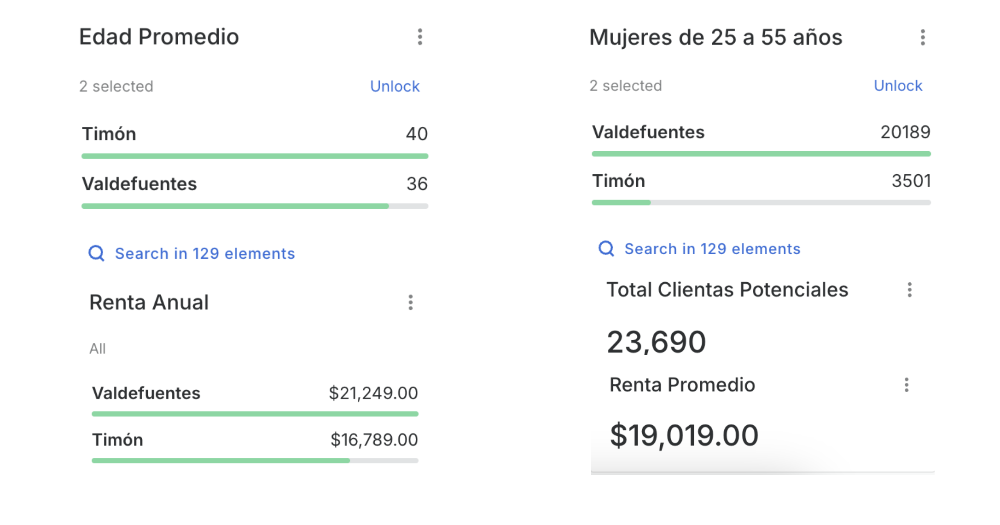
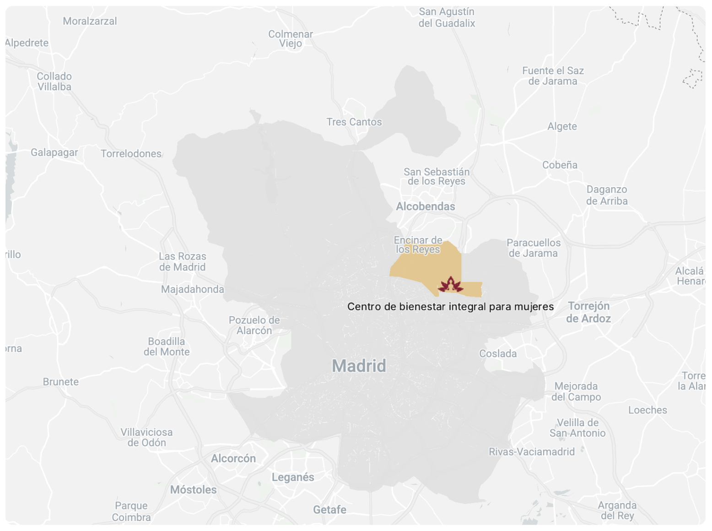
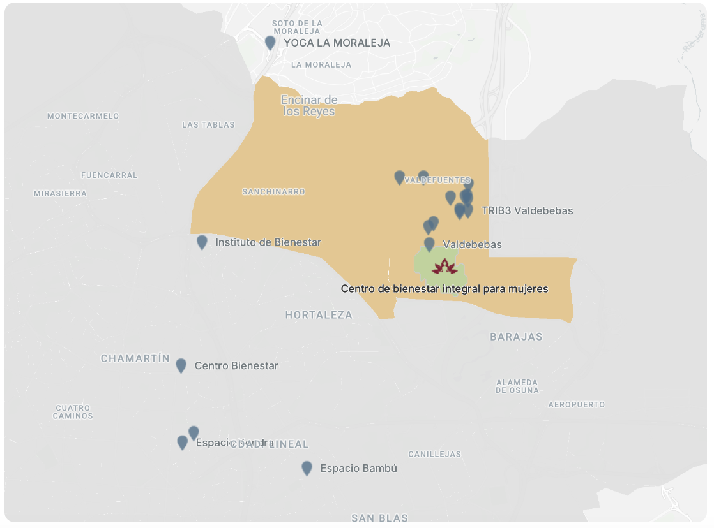

# 🧘‍♀️ Análisis de Viabilidad – Centro de Bienestar Integral para Mujeres (Valdebebas, Madrid)

Este proyecto analiza la viabilidad de abrir un **Centro de Bienestar Integral para Mujeres** en el barrio de **Valdebebas (Madrid)**, utilizando datos demográficos, socioeconómicos y de competencia.  

Se aplicaron técnicas de análisis geoespacial y visualización en **CARTO Builder**, junto con procesamiento previo en **Python** y **Excel**.

---

## 🎯 Objetivo

Identificar la zona óptima para abrir un centro de bienestar para mujeres adultas (25–55 años), considerando:

- Perfil demográfico y nivel socioeconómico.  
- Nivel de competencia en un radio de 1 km.  
- Accesibilidad y entorno urbano.  

---

## 📂 Datos utilizados

### I. Demográficos y socioeconómicos
- **Fuente**: Instituto Nacional de Estadística (INE), Geoportal del Ayuntamiento de Madrid.  
- **Variables**: población femenina (25–55 años), renta media anual.  
- **Nivel geográfico**: secciones censales.  

### II. Localización y competencia
- Coordenadas del local potencial (Juan Antonio Samaranch 51).  
- Centros de yoga, pilates, spas y terapias alternativas recolectados de **Google My Maps**.  
- Clasificación por tipo de negocio y exportación en KML para integración en CARTO. 

### III. Preparación de datos
- Limpieza y cruce de datos en **Python** y **Excel**.  
- Exportación en **Shapefile** para visualización en CARTO.  
- Estilización de capas con paletas personalizadas.  

---

## 🛠️ Tecnologías utilizadas

- **Python** (pandas, geopandas)  
- **Excel**  
- **CARTO Builder**  
- **Google My Maps**  

---

## 📊 Resultados principales

### Datos demográficos y renta promedio

- Edad promedio: 36 (Valdefuentes) – 40 (Timón).  
- Mujeres 25–55 años: 23.690 en total.  
- Renta media anual: 21.249 € en Valdefuentes y 16.789 € en Timón.  

### Mapa general de ubicación en Madrid

### Competencia en la zona de Valdebebas

- Un solo centro de bienestar en un radio de 600m.  
- 19 centros similares en un radio mayor de 1 km, pero sin especialización en mujeres.  
- Buena accesibilidad (estación Renfe cercana y facilidad de aparcamiento).  

---

## 📌 Conclusión

El análisis muestra que Valdebebas es una **zona en expansión** con un perfil poblacional y socioeconómico adecuado para un centro de bienestar enfocado en mujeres. 

Existe una demanda potencial importante y **baja saturación de competencia directa**, lo que convierte a este proyecto en una **oportunidad estratégica de negocio**.  

---

## 📚 Bibliografía

- [Instituto Nacional de Estadística (INE)](https://www.ine.es)  
- [Geoportal del Ayuntamiento de Madrid](https://geoportal.madrid.es)  
- [Google My Maps](https://www.google.com/maps)  

---

## 📄 Licencia  

Este proyecto está bajo la **Licencia MIT** – ver el archivo [LICENSE](LICENSE) para más detalles.  

**Autora:** © 2025 Katherine López Ramírez  
📅 Proyecto – Marzo 2025  
